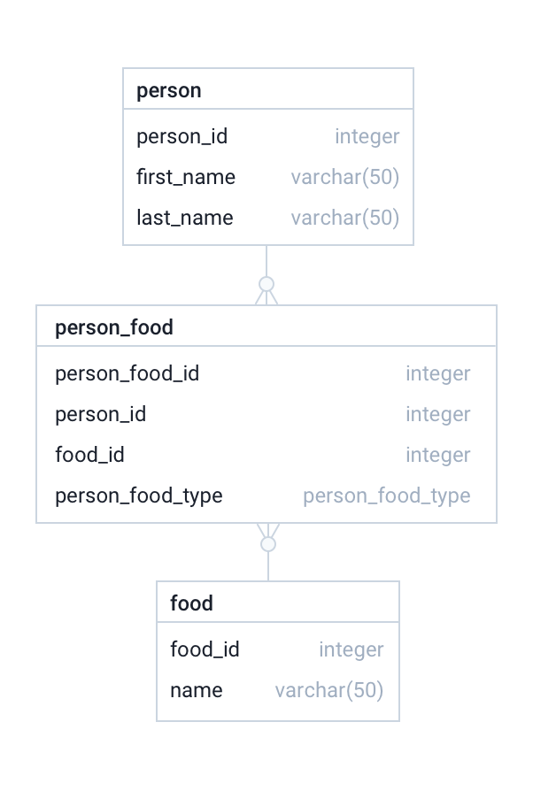
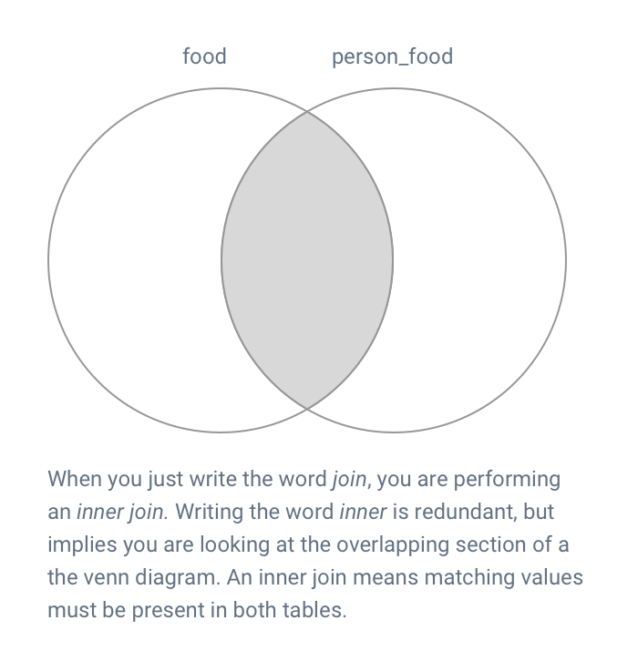
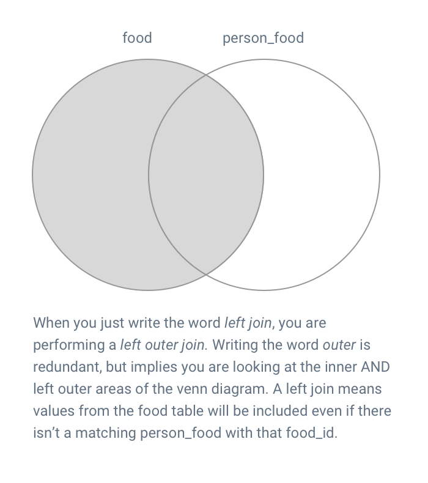

For this dev day, we're going to be using a local postgres instance running on [docker](https://www.docker.com/products/docker-desktop), and the database IDE of your choice (preferably [DataGrip](https://www.jetbrains.com/datagrip/)).


To start the local postgres instance, run 

```
docker run -p 5432:5432 -e POSTGRES_PASSWORD=secret -d postgres
```

In DataGrip, add a connection with the following JDBC url. The username will be **postgres**, and the password will be **secret**.

```
jdbc:postgresql://localhost:5432/postgres
```


## Exercise 1 - Creating tables

This is the *Physical ERD* (see [entity-relationship model](https://en.wikipedia.org/wiki/Entity%E2%80%93relationship_model)) that we will be working with.

This model allows us to add rows to the food table, and track which people LOVE, HATE, or are ALLERGIC to certain foods.



### Excercise 1a 

Create the person food type enum. This type will be used in your **person_food** table.
 
```
create type person_food_type as enum ('LOVES', 'HATES', 'ALLERGIC');
```

### Exercise 1b 

Create the **food** table according to ER Diagram. **Do not** include a primary key declaration in your table create statement. Use all lowercase characters for your table name and column names. 

<details><summary>Answer</summary><p>

```
create table food (
    food_id integer,
    name varchar(50) not null
);
```
</p></details>


### Exercise 1c 

Create the **person** and **person_food** tables. **Do not** include primary key or foreign key declarations in your create statements. 

<details><summary>Answer</summary><p>

```
create table person (
    person_id integer,
    first_name varchar(50) not null,
    last_name varchar(50) not null
);

create table person_food (
    person_food_id integer,
    person_id integer,
    food_id integer,
    person_food_type person_food_type not null
);
```
</p></details>


### Exercise 1d 

In this exercise we will examine the table metadata using the *information_schema*. The tables were created in the **public** schema. To view all tables in the public schema, execute the following: 

```
select * from information_schema.tables where table_schema = 'public';
```

To view all *columns* in the food table, execute the following: 

```
select * from information_schema.columns where table_name = 'food';
```

To view all *table constraints* on the food table, execute the following:

If you made the food.name column *not null*, you should see a check constraint. 

```
select * from information_schema.table_constraints where table_name = 'food';
```

Add a primary key to the food table:

```
alter table food add constraint food_pk primary key (food_id);
```

Let's look at the table constraints again (note the addition of the primary key constraint)
```
select * from information_schema.table_constraints where table_name = 'food';
```

When you add a primary key, it will also create a *unique index*. Indexes are important for database performance. To view the index, execute the following:

```
select * from pg_indexes where tablename = 'food';
```

### Exercise 1e - Explain Plans

Although we don't have any data in our database, and our primary keys, foreign keys, and indexes aren't fully created, we're going to see how the database engine might process our queries.

In DataGrip, write the following, right click on each statement and choose 'Explain Plan'

```
select * from food where food_id = 1;
select * from person where person_id = 1;
```

OR if you want to look at the raw output, write the following:

```
explain select * from food where food_id = 1;
explain select * from person where person_id = 1;
```

Note that the database engine will use an *index scan* on the food query, using the unique index on the food_id column. Because the person table **does not** have any indexes, a *sequential scan* or *full table scan* is required to execute the person query. In a table with only a few rows, you won't notice a performance impact of a full table scan; however, you would notice an impact if the person table had 20 million rows. Throughout this dev day, feel free to run explain plans on your queries to assess the performance of your queries. 

## Exercise 1f 

Create primary keys on the person and person_food tables

<details><summary>Answer</summary><p>

```
alter table person add constraint person_pk primary key (person_id);
alter table person_food add constraint person_food_pk primary key (person_food_id);
```
</p></details>


## Exercise 1g

Create foreign key constraints AND indexes.

The person_food table provides a linkage of which people LOVE, HATE, or are ALLERGIC to which foods. To enforce data integrity, we add *foreign keys*.

To view all *referential constraints* in the public schema, execute the following (right now there will be none):

```
select * from information_schema.referential_constraints where constraint_schema = 'public';
```

Add a foreign key to person_food.person_id to reference person.person_id.
Add a foreign key to person_food.food_id to reference food.food_id.

<details><summary>Answer</summary><p>

```
alter table person_food add constraint person_food_fk1 foreign key(person_id) references person(person_id);
alter table person_food add constraint person_food_fk2 foreign key(food_id) references food(food_id);
```
</p></details>

Note that creating primary keys automatically created indexes. Creating foreign key constraints **does not** automatically create indexes. 
            
**Why is this important?** We almost always want indexes on foreign keys, but why? 

Let's pretend we have some data in the database:

| food_id     | name        |
| ----------- | ----------- |
| 1           | Strawberries|
| 2           | Grapes      |

We executed the following sql:

```
delete from food where food_id = 1;
```

Because we have a foreign key constraint on person_food.food_id to ensure that people don't LOVE or HATE foods that don't actually exist, what will the database engine have to do before successfully deleting strawberries?

<details><summary>Answer</summary><p>

The database engine will have to ensure that no rows exist in the person_food table that have a food_id of 1 before successfully deleting the row from the food table. If the food_id in the person_food table was NOT indexed, the database engine would have to perform a *full table scan* (rather than an index scan if the column was indexed) of the person_food table to ensure this is valid. This is one reason why it's important to index foreign keys.

</p></details>

So let's create those indexes on the two foreign key columns in the person_food table.

```
create index person_food_ix1 on person_food(person_id);
create index person_food_ix2 on person_food(food_id);
```

## Summary

In this exercise we

- created 3 tables
- added primary key constraints (and inherently unique indexes) to the primary key columns
- added foreign key constraints to enforce referential integrity (data integrity)
- added indexes to the foreign keys
- looked at the database engine's *plan* to evaluate the performance of a query 

## Exercise 2 - Basic Queries

Before starting exercise 2, run the following inserts to populate your database. Take a look at the inserts to understand the data we have created.

```
--insert 6 types of food
insert into food values (1, 'Apples');
insert into food values (2, 'Bananas');
insert into food values (3, 'Cherries');
insert into food values (4, 'Durian');
insert into food values (5, 'Peanuts');
insert into food values (6, 'Kiwi');

--insert 6 people
insert into person values (1, 'Eats everything Joe', 'Smith');
insert into person values (2, 'Eats everything Jane', 'Smith');
insert into person values (3, 'Picky Fran', 'Roberts');
insert into person values (4, 'Picky Maurice', 'Renolds');
insert into person values (5, 'Picky Richard', 'Hope');
insert into person values (6, 'Allergic Garth', 'Pensworth');

--inserts for person 1
insert into person_food values (1, 1, 1, 'LOVES');
insert into person_food values (2, 1, 2, 'LOVES');
insert into person_food values (3, 1, 3, 'LOVES');
insert into person_food values (4, 1, 4, 'LOVES');
insert into person_food values (5, 1, 5, 'LOVES');
insert into person_food values (6, 1, 6, 'HATES');

--inserts for person 2
insert into person_food values (7, 2, 1, 'LOVES');
insert into person_food values (8, 2, 2, 'LOVES');
insert into person_food values (9, 2, 3, 'LOVES');
insert into person_food values (10, 2, 4, 'LOVES');
insert into person_food values (11, 2, 5, 'LOVES');
insert into person_food values (12, 2, 6, 'LOVES');

--inserts for person 3
insert into person_food values (13, 3, 1, 'LOVES');
insert into person_food values (14, 3, 2, 'HATES');
insert into person_food values (15, 3, 3, 'HATES');
insert into person_food values (16, 3, 4, 'HATES');
insert into person_food values (17, 3, 5, 'HATES');
insert into person_food values (18, 3, 6, 'HATES');

--inserts for person 4. Note there are only 5 inserts instead of 6!
insert into person_food values (19, 4, 1, 'LOVES');
insert into person_food values (20, 4, 2, 'LOVES');
insert into person_food values (21, 4, 3, 'HATES');
insert into person_food values (22, 4, 4, 'HATES');
insert into person_food values (23, 4, 5, 'HATES');

--inserts for person 5. Note there are only 4 inserts instead of 6!
insert into person_food values (24, 5, 1, 'LOVES');
insert into person_food values (25, 5, 2, 'LOVES');
insert into person_food values (26, 5, 3, 'HATES');
insert into person_food values (27, 5, 4, 'HATES');

--inserts for person 6. Note person 6 is the only person with allergies
insert into person_food values (28, 6, 1, 'LOVES');
insert into person_food values (29, 6, 2, 'LOVES');
insert into person_food values (30, 6, 3, 'HATES');
insert into person_food values (31, 6, 4, 'ALLERGIC');
insert into person_food values (32, 6, 5, 'ALLERGIC');
insert into person_food values (33, 6, 6, 'ALLERGIC');
```

## Exercise 2a 

Select from the person table. Select the last name and first name of all people as a single string delimited by a comma.

**expected output**

| name                              |
| --------------------------------- | 
|Smith, Eats everything Joe         |
|Smith, Eats everything Jane        |
|Roberts, Picky Fran                |
|Renolds, Picky Maurice             |
|Hope, Picky Richard                |
|Pensworth, Allergic Garth          |

<details><summary>Hint</summary><p>

`||` can be used to concatenate values 

</p></details>


<details><summary>Answer</summary><p>

```
select p.last_name || ', ' || p.first_name as name from person p;
```
</p></details>

## Exercise 2b 

Select from the person table. Select the last name and first name of all people as a single string delimited by a comma.

 - First name and last name should be uppercase.  
 - results should be ordered by last name, then by first name

<details><summary>Hint</summary><p>

the `upper` function can be used to uppercase values. e.g. UPPER(column_name)
the `order by` clause can be used to order results

</p></details>

**expected output**

| name                              |
| --------------------------------- | 
| PICKY RICHARD HOPE                |
| ALLERGIC GARTH PENSWORTH          |
| PICKY MAURICE RENOLDS             |
| PICKY FRAN ROBERTS                |
| EATS EVERYTHING JANE SMITH        |
| EATS EVERYTHING JOE SMITH         |

<details><summary>Answer</summary><p>

```
select UPPER(p.first_name) || ' ' || UPPER(p.last_name) as name
  from person p
  order by last_name, first_name;
```
</p></details>

## Exercise 2e

select all person records with a last name starting with the letter R

<details><summary>Hint</summary><p>

use `like`

</p></details>

<details><summary>Answer</summary><p>

```
select * from person where last_name like 'R%';
```
</p></details>


## Exercise 2e

select all person records with a last name starting with the letter R follows by any 5 characters, and ending in s 

<details><summary>Hint</summary><p>

`%` is analogous to *
`_` is analogous to . 

</p></details>

<details><summary>Answer</summary><p>

```
select * from person where last_name like 'R_____s';
```
</p></details>

## Exercise 2e

select all person records with a last name of Smith or Hope

<details><summary>Answer</summary><p>

```
select * from person where last_name in ('Smith', 'Hope');
```
-- or --
```
select * from person where last_name = 'Smith' or last_name = 'Hope';
```
</p></details>

## Exercise 2c

count the number of records in the person table

**expected output**

| count                             |
| --------------------------------- | 
| 6                                 |


<details><summary>Answer</summary><p>

```
select count(*) from person p;
```
</p></details>

## Exercise 2d

count the number of people with the same last name. If you look at the inserts, 2 people have the last name 'Smith'.

**expected output**

| count         | last_name |
| --------------|-----------|
| 2             | Smith     |
| 1             | Hope      |
| 1             | Roberts   |
| 1             | Renolds   |
| 1             | Pensworth |

<details><summary>Hint</summary><p>

use `group by` to group the results

</p></details>

<details><summary>Answer</summary><p>

```
select count(*), last_name
  from person p
  group by last_name;
  
```
Note: group by is used to collapse rows.

</p></details>


Count the number of people with the same last name. Only display last having **having** a count of greater than 1


<details><summary>Answer</summary><p>

```
select count(*), last_name
  from person p
  group by last_name
  having count(*) > 1;
```
</p></details>

## Exercise 3 - Joins

[Joins](https://en.wikipedia.org/wiki/Join_(SQL)) are a way of linking result sets. Pretend we have the following data:

**table:** person

| person_id | first_name |
| ----------|------------|
| 1         | Fred       |
| 2         | Wanda      |

**table:** person_food        

| person_food_id | person_id  | person_food_type | food_id     | 
| ---------------|------------|------------------|-------------| 
| 1              | 1          |  LOVES           |  1          | Fred (person_id == 1) LOVES Apples (food_id == 1)
| 2              | 1          |  HATES           |  2          | Fred (person_id == 1) HATES Bananas (food_id == 2)

```      
select * from person p
  join person_food pf on pf.person_id = p.person_id;
```

will `join` the table data and give the following results:
              
| p.person_id | first_name | person_food_id | pf.person_id  | person_food_type | food_id     |    
| ------------|------------| ---------------|---------------|------------------|-------------|    
| 1           | Fred       | 1              | 1             |  LOVES           |  1          |    
| 1           | Fred       | 2              | 1             |  HATES           |  2          | 

If this makes sense to you, carry on! If this doesn't make sense to you, ask a neighbour for help!

[Inner Joins](https://en.wikipedia.org/wiki/Join_(SQL)#Inner_join)
   

Notice that 'Wanda' is not present in the result set because there are no records for person_id == 2 in the person_food table. Sometimes, you'll want to include those records however. You would do that with a `left join`.

```      
select * from person p
  left join person_food pf on pf.person_id = p.person_id;
```

will *left join* the table data and give the following results:

| p.person_id | first_name | person_food_id | pf.person_id  | person_food_type | food_id     |    
| ------------|------------| ---------------|---------------|------------------|-------------|    
| 1           | Fred       | 1              | 1             |  LOVES           |  1          |    
| 1           | Fred       | 2              | 1             |  HATES           |  2          | 
| 2           | Wanda      | null           | null          |  null            |  null       | 

[Left Joins](https://en.wikipedia.org/wiki/Join_(SQL)#Left_outer_join)


If this makes sense to you, carry on! If this doesn't make sense to you, ask a neighbour for help!


### Exercise 3a

Develop a query to display each of the foods, and how many people **LOVES** that food. You'll want to start with the food table, and `join` to the food_preference table.

**expected output**

| name      | count      | preference|
| ----------|------------|-----------|
| Apples    | 6          | LOVES     |
| Bananas   | 5          | LOVES     |
| Cherries  | 2          | LOVES     |
| Durian    | 2          | LOVES     |
| Kiwi      | 1          | LOVES     |
| Peanuts   | 2          | LOVES     |


<details><summary>Answer</summary><p>

```
select f.name, count(*) count, 'LOVES' preference from food f
  join person_food pf on pf.food_id = f.food_id and person_food_type = 'LOVES'
  group by f.name;
  
Note: this join syntax is part of the ANSI SQL1992 standard
```
</p></details>

### Exercise 3b

Develop a query to display each of the foods, and how many people **HATES** that food.

**expected output**

| name      | count      | preference|
| ----------|------------|-----------|
| Bananas   | 1          | HATES     |
| Cherries  | 4          | HATES     |
| Durian    | 3          | HATES     |
| Kiwi      | 2          | HATES     |
| Peanuts   | 2          | HATES     |

<details><summary>Answer</summary><p>

```
select f.name, count(*) count, 'HATES' preference from food f
  join person_food pf on pf.food_id = f.food_id and person_food_type = 'HATES'
  group by f.name;  
```

Note there are only 5 hated foods rather that 6. You aren't getting back a row for Apples with a count of 0. Why is this?

</p></details>


### Exercise 3c

Modify your query so Apples is displayed with a count of 0. (change your join type)


**expected output**

| name      | count      | preference|
| ----------|------------|-----------|
| Apples    | 0          | HATES     |
| Bananas   | 1          | HATES     |
| Cherries  | 4          | HATES     |
| Durian    | 3          | HATES     |
| Kiwi      | 2          | HATES     |
| Peanuts   | 2          | HATES     |


<details><summary>Answer</summary><p>

```
select f.name, count(*) count, 'HATES' preference from food f
  left join person_food pf on pf.food_id = f.food_id and person_food_type = 'HATES'
  group by f.name;
 
```
</p></details>

### Exercise 3d

Develop a query to display each of the foods, and how many people **LOVES** that food, and how many people **HATES** that food (as separate rows). You've already developed the queries, now you just have to combine them (hint `union`).

**expected output**

| name      | count      | preference|
| ----------|------------|-----------|
| Apples    | 0          | HATES     |
| Bananas   | 1          | HATES     |
| Cherries  | 4          | HATES     |
| Durian    | 3          | HATES     |
| Kiwi      | 2          | HATES     |
| Peanuts   | 2          | HATES     |
| Apples    | 6          | LOVES     |
| Bananas   | 5          | LOVES     |
| Cherries  | 2          | LOVES     |
| Durian    | 2          | LOVES     |
| Kiwi      | 1          | LOVES     |
| Peanuts   | 2          | LOVES     |

<details><summary>Answer</summary><p>

```
select f.name, count(person_food_type) count, 'LOVES' preference from food f
  left join person_food pf on pf.food_id = f.food_id and person_food_type = 'LOVES'
  group by f.name
union
select f.name, count(person_food_type), 'HATES' from food f
  left join person_food pf on pf.food_id = f.food_id and person_food_type = 'HATES'
  group by f.name
order by preference, count, name;
```
</p></details>


### Exercise 4 - Common table expressions

[Common table expressions](https://en.wikipedia.org/wiki/Hierarchical_and_recursive_queries_in_SQL#Common_table_expression) are included in the ANSI SQL1999 standard. When developing sql queries and reports, you often want to make intermediate result sets to simplify your query. A common table expressions is a temporary named result set, derived from a simple query, using a `with` clause.

Here is an example with some static data (created by union-ing values)

```
with fancy_temp_results as (
    select 'hello' column_alias UNION
    select 'world'              UNION
    select 'goodnight'          UNION
    select 'moon')
select * from fancy_temp_results t;
```

In a query, you can have *multiple* CTEs:

```
with
 data_to_fix_ids as (
    select 1 column_alias  UNION
    select 17              UNION
    select 29              UNION
    select 32),
 fancy_temp_results as (
    select 'hello' column_alias UNION
    select 'world' UNION
    select 'goodnight' UNION
    select 'moon')
select * from fancy_temp_results, data_to_fix_ids;
```

Include the results of Exercise 3d in a CTE (name your result set **preferences**). Use your CTE to develop a query that has the following output:

**expected output**
             
| name      | # loves     | # hates    |
| ----------|-------------|------------|
| Cherries  | 2           | 4          |
| Bananas   | 5           | 1          |
| Peanuts   | 2           | 2          |
| Kiwi      | 1           | 2          |
| Apples    | 6           | 0          |
| Durian    | 2           | 3          |


<details><summary>Hint</summary><p>

If you're having trouble getting started, start here:

```
with preferences as (SELECT * from (
         select f.name, count(person_food_type) count, 'LOVES' preference
         from food f
         left join person_food pf on pf.food_id = f.food_id and person_food_type = 'LOVES'
         group by f.name
         UNION
         select f.name, count(person_food_type), 'HATES' preference
         from food f
         left join person_food pf on pf.food_id = f.food_id and person_food_type = 'HATES'
         group by f.name
     ) t)
select * from preferences;
```
</p></details>


<details><summary>Answer</summary><p>

```
with preferences as (SELECT * from (
         select f.name, count(person_food_type) count, 'LOVES' preference
         from food f
         left join person_food pf on pf.food_id = f.food_id and person_food_type = 'LOVES'
         group by f.name
         union
         select f.name, count(person_food_type), 'HATES' preference
         from food f
         left join person_food pf on pf.food_id = f.food_id and person_food_type = 'HATES'
         group by f.name
     ) t)
select loves.name, loves.count "# loves", hates.count "# hates"
  from preferences loves
  join preferences hates on hates.name = loves.name
  where loves.preference = 'LOVES'
  and hates.preference = 'HATES';
```
</p></details>


## Exercise 5 - Window functions

[Window functions](https://en.wikipedia.org/wiki/Window_function_(SQL)) (or analytic functions as Oracle calls them) are part of the ANSI SQL2003 standard. Window functions allow us to perform aggregate operations on a subset of the date (averages, counts, sums etc). Window functions **do not collapse rows** like a group by. They are most useful when you want to include totals at a row level in a report.

Here is a simple example:

```
select person_id,
   first_name,
   last_name,
   count(*) over (partition by last_name) has_same_last
   from person;
```

will give the following results:

|person_id  | first_name            | last_name   | has_same_last  |
|-----------|-----------------------|-------------|----------------|
|5          |Picky Richard          | Hope        | 1              |
|6          |Allergic Garth         | Pensworth   | 1              |
|4          |Picky Maurice          | Renolds     | 1              |
|3          |Picky Fran             | Roberts     | 1              |
|1          |Eats everything Joe    | Smith       | 2              |
|2          |Eats everything Jane   | Smith       | 2              |

       
In exercise 5 we will try to produce the following dataset:
                                                    
the first row means:

- Eats everything Joe LOVES Apples. 
- 6 people in total love apples. 
- 0 people in total hate apples. 
- There are a total of 18 loves (including other fruit). 
- There are a total of 12 hates (including other fruit).

|first_name                |preference|name     |total loves by fruit   | total hates by fruit    | total loves   | total hates |
|--------------------------|----------|---------|-----------------------|-------------------------|---------------|-------------|
|Eats everything Joe       |LOVES     |Apples   |6                      | 0                       | 18            | 12          |
|Eats everything Jane      |LOVES     |Apples   |6                      | 0                       | 18            | 12          |
|Picky Fran                |LOVES     |Apples   |6                      | 0                       | 18            | 12          |
|Picky Maurice             |LOVES     |Apples   |6                      | 0                       | 18            | 12          |
|Picky Richard             |LOVES     |Apples   |6                      | 0                       | 18            | 12          |
|Allergic Garth            |LOVES     |Apples   |6                      | 0                       | 18            | 12          |
|Eats everything Joe       |LOVES     |Bananas  |5                      | 1                       | 18            | 12          |
|Eats everything Jane      |LOVES     |Bananas  |5                      | 1                       | 18            | 12          |
|Picky Fran                |HATES     |Bananas  |5                      | 1                       | 18            | 12          |
|Picky Maurice             |LOVES     |Bananas  |5                      | 1                       | 18            | 12          |
|Picky Richard             |LOVES     |Bananas  |5                      | 1                       | 18            | 12          |
|Allergic Garth            |LOVES     |Bananas  |5                      | 1                       | 18            | 12          |
|Eats everything Joe       |LOVES     |Cherries |2                      | 4                       | 18            | 12          |
|Eats everything Jane      |LOVES     |Cherries |2                      | 4                       | 18            | 12          |
|Picky Fran                |HATES     |Cherries |2                      | 4                       | 18            | 12          |
|Picky Maurice             |HATES     |Cherries |2                      | 4                       | 18            | 12          |
|Picky Richard             |HATES     |Cherries |2                      | 4                       | 18            | 12          |
|Allergic Garth            |HATES     |Cherries |2                      | 4                       | 18            | 12          |
|Eats everything Joe       |LOVES     |Durian   |2                      | 3                       | 18            | 12          |
|Eats everything Jane      |LOVES     |Durian   |2                      | 3                       | 18            | 12          |
|Picky Fran                |HATES     |Durian   |2                      | 3                       | 18            | 12          |
|Picky Maurice             |HATES     |Durian   |2                      | 3                       | 18            | 12          |
|Picky Richard             |HATES     |Durian   |2                      | 3                       | 18            | 12          |
|Allergic Garth            |ALLERGIC  |Durian   |2                      | 3                       | 18            | 12          |
|Allergic Garth            |ALLERGIC  |Kiwi     |1                      | 2                       | 18            | 12          |
|Eats everything Joe       |HATES     |Kiwi     |1                      | 2                       | 18            | 12          |
|Eats everything Jane      |LOVES     |Kiwi     |1                      | 2                       | 18            | 12          |
|Picky Fran                |HATES     |Kiwi     |1                      | 2                       | 18            | 12          |
|Picky Maurice             |UNKNOWN   |Kiwi     |1                      | 2                       | 18            | 12          |
|Picky Richard             |UNKNOWN   |Kiwi     |1                      | 2                       | 18            | 12          |
|Eats everything Joe       |LOVES     |Peanuts  |2                      | 2                       | 18            | 12          |
|Eats everything Jane      |LOVES     |Peanuts  |2                      | 2                       | 18            | 12          |
|Picky Fran                |HATES     |Peanuts  |2                      | 2                       | 18            | 12          |
|Picky Maurice             |HATES     |Peanuts  |2                      | 2                       | 18            | 12          |
|Picky Richard             |UNKNOWN   |Peanuts  |2                      | 2                       | 18            | 12          |
|Allergic Garth            |ALLERGIC  |Peanuts  |2                      | 2                       | 18            | 12          |
  
### Exercise 5a

Let's start with just the first 3 columns. 

Note that ALL fruits are included and ALL people are included in the result set. For anyone who remembers linear algebra, this is a 'cross product'.                                                                                                                   

Picky Maurice, as an example, as no person_food record for Kiwi. In the result set, we want to mark his preference as unknown.

<details><summary>Answer</summary><p>

```
select
  p.first_name,
  coalesce(pf.person_food_type::varchar, 'UNKNOWN'),
  f.name
  from food f
  cross join person p
  left join person_food pf on pf.food_id = f.food_id and pf.person_id = p.person_id;
  
  
  Note: coalesce is an ANSI SQL1992 function to return the first non-null value
```
</p></details>

### Exercise 5b

Add window functions to add the columns

 - total loves by fruit
 - total hates by fruit
 - total loves
 - total hates

<details><summary>Answer</summary><p>

```
select
  p.first_name,
  coalesce(pf.person_food_type::varchar, 'UNKNOWN'),
  f.name,
  count(*) FILTER (WHERE pf.person_food_type = 'LOVES') over (partition by f.name) as total_loves_by_fruit,
  count(*) FILTER (WHERE pf.person_food_type = 'HATES') over (partition by f.name) as total_hates_by_fruit,
  count(*) FILTER (WHERE pf.person_food_type = 'LOVES') over () as total_loves,
  count(*) FILTER (WHERE pf.person_food_type = 'HATES') over () as total_hates
  from food f
  cross join person p
  left join person_food pf on pf.food_id = f.food_id and pf.person_id = p.person_id;
```
</p></details>

## Exercise 6

Challenge a friend (or me!). Come up with a result set from this data structure or another, and have a friend try to match your query results. 
